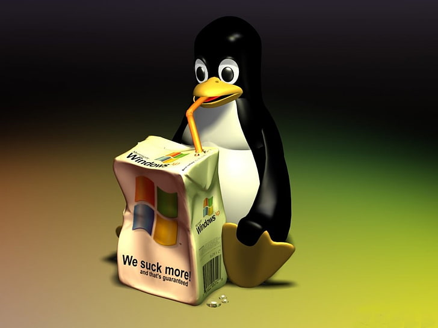
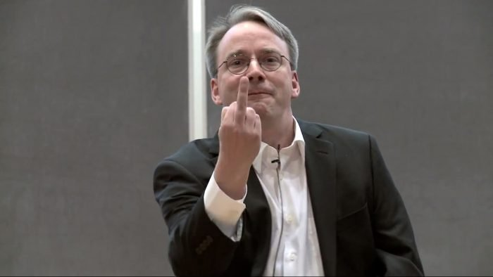

# MarcaoDaProgramacao

**Número da Lista**: IndexOutOfRange 
**Conteúdo da Disciplina**: Dynamic Programming 

## Alunos
|Matrícula | Aluno |
| -- | -- |
| 18/0033620  |  João Henrique C. Paulino |
| 18/0052845  |  Gabriela da Gama Pivetta |

## Sobre 
Marcão é um engenheiro de software que se formou na UNB no ano de 1992. Um ano antes um jovem finlandês chamado Linus Torvalds decidiu
irritar o modelo de negócios inerente ao mundo dos softwares. Na década de noventa a maioria dos programas eram produzidos com o código
fexado e raramente eram atualizados, o que obrigava os usuários dos programas a sofrerem com um produto que não se adequava as suas 
necescidades. 

Neste período Linus, que é um programador, usou um software proprietário defeituoso de uma impressora e mesmo sabendo como
solucionar o problema não pôde fazê-lo por se tratar de um código fechado. Ante a tal situação, a reação dele foi a mais
incomum para a época: reescrever o driver do começo ao fim e publicar esse com as 4 atuais liberdades do software livre.
Este foi um dos movimentos iniciais do software livre e do desenvolvimento do sistema operacional LINUX.

Marcão, que um dia foi um aluno da UNB e é um exímio programador C e C++ hoje é um empresário de sucesso, dono da empresa
Engenharia de Quintal ltda. A empresa, além de fazer sistemas web e aplicativos de celular, contribui ativamente com as atualizações
do kernel linux. Portanto no processo de seleção de novos estagiários existe a etapa de programação em c e c++ de problemas de tópicos
específicos da ciência da computação. 

Atualmente João e Gabriela estão aplicando para um estágio na empresa de Marcão e o tópico abordado desta vez é Programação por tabelas
(Dynamic Programming). E para fins organizacionais a dupla decidiu colocar os códigos dos problemas resolvidos no github.

## Screenshots

Aqui observamos o Tux(mascote do Linux) se relacionando 
harmonicamente com o sistema operacional Windows.

Abaixo podemos ver como Linus teve calma e tranquilidade com
a empresa que fez o driver de impressora de baixa qualidade.

## Instalação 
**Linguagem**: C | C++ 

Pre requisitos gcc e g++17 instalados.

## Uso 
Só mandar as questões para o site e id_questão do problema os dados das questões resolvidas podem ser encontrados no cabeçalho de cada arquivo.
